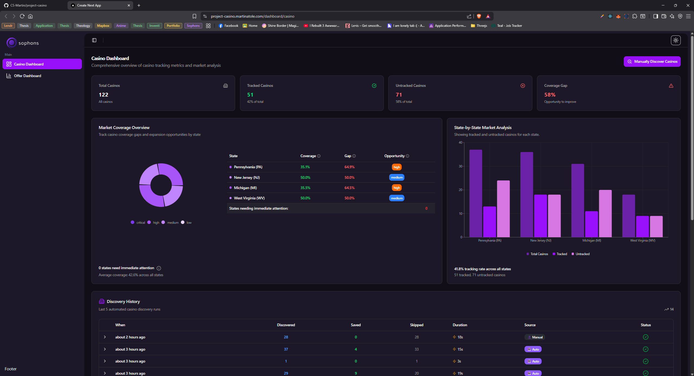

# Casino Intelligence Platform

> A full-stack AI-powered platform for automated casino discovery and promotional offer tracking with real-time analytics dashboards.

🔗 **Live Demo**: [https://project-casino.martinatole.com](https://project-casino.martinatole.com)

[](https://nextjs.org/)
[](https://www.typescriptlang.org/)
[](https://convex.dev/)
[](https://tailwindcss.com/)

## Sample Screenshots

### Casino Dashboard


_Real-time casino management with KPI metrics, market coverage visualization, and discovery history_

## Overview

This platform automates the discovery and tracking of casino promotional offers across multiple states using AI-powered research and real-time analytics.

**Key Capabilities:**

- AI-powered casino discovery with duplicate detection
- Automated promotional offer research using GPT-4
- Real-time dashboards with interactive visualizations
- Complete audit trail of all discoveries and research
- Batch processing with smart scheduling

## Tech Stack

- **Frontend**: Next.js 15.5, TypeScript, Tailwind CSS 4.0, shadcn/ui
- **Backend**: Convex (serverless real-time database)
- **AI**: OpenAI GPT-4o-mini with web search
- **UI/UX**: Recharts, Framer Motion, Radix UI
- **Package Manager**: Bun

## Prerequisites

- Node.js 18+ and Bun (or npm/yarn/pnpm)
- [Convex account](https://convex.dev) (free tier available)
- [OpenAI API key](https://platform.openai.com)
- [Upstash Redis](https://upstash.com) (required for caching and rate limiting)

## Quick Start

### 1. Clone and Install

```bash
git clone https://github.com/CS-Martin/project-casino.git
cd project-casino
bun install
```

### 2. Set Up Convex

```bash
npx convex dev
```

This will:

- Create or connect to a Convex project
- Auto-generate `.env.local` with Convex credentials
- Start the Convex development server

Your `.env.local` should now contain:

```env
CONVEX_DEPLOYMENT=your-deployment-name
NEXT_PUBLIC_CONVEX_URL=https://your-deployment.convex.cloud
```

### 3. Add API Keys

Add to `.env.local`:

```env
# OpenAI (required for AI features)
OPENAI_API_KEY=sk-your-openai-api-key

# Upstash Redis (required for caching and rate limiting)
UPSTASH_REDIS_REST_URL=https://your-redis-url.upstash.io
UPSTASH_REDIS_REST_TOKEN=your-redis-token

# Logging (optional - defaults to 'error' in production, 'debug' in development)
# Options: 'error' | 'warn' | 'info' | 'debug'
LOG_LEVEL=error
```

Add OpenAI key to Convex environment:

```bash
npx convex env set OPENAI_API_KEY sk-your-openai-api-key
```

> **Note**: Upstash Redis is required for the application to run. Get a free tier account at [upstash.com](https://upstash.com)

### 4. Run the Application

```bash
bun dev
```

The application will be available at `http://localhost:3000`

**Available Routes:**

- `/dashboard/casino` - Casino management and discovery
- `/dashboard/offer` - Offer research and analytics

## Features

### 🎰 Casino Dashboard

- **KPI Cards**: Total casinos, tracking status, coverage metrics with helpful tooltips
- **Market Coverage**: Interactive pie chart showing state distribution
- **Discovery History**: Resizable panels comparing saved vs duplicate casinos
- **Search & Filter**: Real-time casino search with pagination

### 🎁 Offer Dashboard

- **Offer Analytics**: Total offers, active offers, daily research stats
- **Timeline Chart**: Interactive visualization of research activity over time
- **Type Breakdown**: Distribution of offer types (welcome bonuses, no deposit, etc.)
- **Detailed Views**: Expandable offer cards with full terms and conditions

### 🤖 AI Automation

- **Casino Discovery**: Automated discovery of licensed casinos by state
- **Duplicate Detection**: String similarity matching (80%+ threshold) prevents duplicates
- **Offer Research**: Batch processing with priority-based scheduling (70% tracked, 30% untracked)
- **Scheduled Jobs**: Automated daily research via cron jobs

## Project Structure

```
project-casino/
├── src/
│   ├── app/                           # Next.js app router
│   │   ├── (main)/dashboard/         # Dashboard pages
│   │   └── api/                      # API endpoints
│   ├── components/                   # Shared UI components
│   ├── features/                     # Feature modules
│   │   ├── casino-dashboard/         # Casino dashboard
│   │   ├── casino-discovery/         # AI discovery logic
│   │   ├── offer-dashboard/          # Offer analytics
│   │   └── promotional-research/     # Offer research AI
│   └── lib/                          # Utilities
│
├── convex/                           # Convex backend
│   ├── casinos/                      # Casino CRUD + actions
│   ├── offers/                       # Offer CRUD + analytics
│   ├── casino_discovery_logs/        # Discovery audit trail
│   ├── offer_research_logs/          # Research audit trail
│   ├── schema.ts                     # Database schema
│   └── crons.ts                      # Scheduled jobs
│
└── public/                           # Static assets
```

## API Usage

### Trigger Casino Discovery

```bash
POST http://localhost:3000/api/casinos/research
```

### Trigger Offer Research

```bash
POST http://localhost:3000/api/offers/research/batch
Content-Type: application/json
{"batchSize": 30}
```

### View Best Offers

```bash
GET http://localhost:3000/api/offers/best
```

### Using Convex CLI

```bash
npx convex dashboard      # Open Convex dashboard
npx convex logs --watch   # View real-time logs
npx convex crons          # Check scheduled jobs
```

## How It Works

### Casino Discovery Process

1. AI agent searches for licensed casinos by state using web search
2. Validates licensing information and website availability
3. Checks for duplicates using string similarity algorithms
4. Saves new casinos and logs duplicates with similarity scores
5. Records complete audit trail in discovery logs

### Offer Research Process

1. Selects batch of casinos (prioritizing tracked casinos)
2. AI researches current promotional offers via web search
3. Extracts structured data (bonus amounts, terms, validity)
4. Validates data against Zod schemas
5. Stores offers with full metadata and timestamps
6. Updates casino last-check timestamp for smart scheduling

### Duplicate Detection

- Exact name matching
- Substring matching
- Levenshtung distance calculation
- Website URL comparison
- Configurable similarity threshold (default: 0.8)

## Configuration

Key configuration files:

- `convex/crons.ts` - Scheduled job configuration
- `src/features/casino-discovery/services/casino-duplicate-detector.service.ts` - Duplicate detection settings
- `convex/casinos/queries/getCasinosForOfferResearch.ts` - Batch processing logic

**Default Settings:**

- Batch Size: 30 casinos per research run
- Priority Split: 70% tracked, 30% untracked casinos
- Duplicate Threshold: 80% string similarity
- Research Frequency: Daily via cron (configurable)

## Security Note

⚠️ **Important**: This project currently has **no authentication** on backend functions.

- All Convex queries/mutations are publicly accessible
- **Live demo** at [project-casino.martinatole.com](https://project-casino.martinatole.com) is intentionally public for demonstration
- Suitable for demo/portfolio projects
- Add authentication before production use with sensitive data
- Safe to share Convex URLs for educational/demo purposes

**What's Safe to Share:**

- `NEXT_PUBLIC_CONVEX_URL` (already exposed in client)
- `CONVEX_DEPLOYMENT` (just an identifier)

**Never Share:**

- `OPENAI_API_KEY`
- `CONVEX_DEPLOY_KEY`
- Any other API keys or secrets

## Development

```bash
# Start development servers
bun dev

# Run type checking
npx tsc --noEmit

# View Convex functions
npx convex dashboard

# Check logs
npx convex logs --tail 50
```

## License

This project is licensed under the MIT License.

---

Built with ❤️ using Next.js, Convex, and OpenAI
